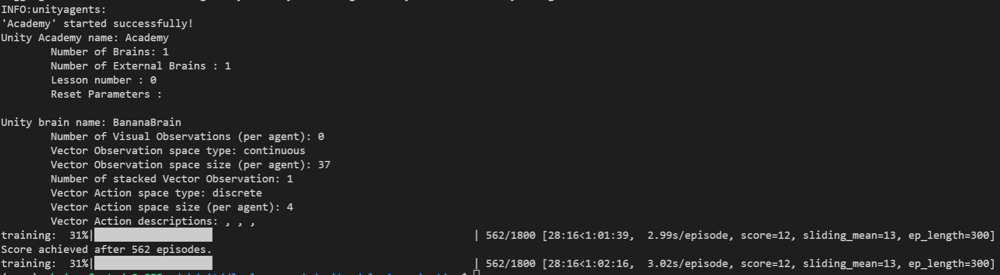
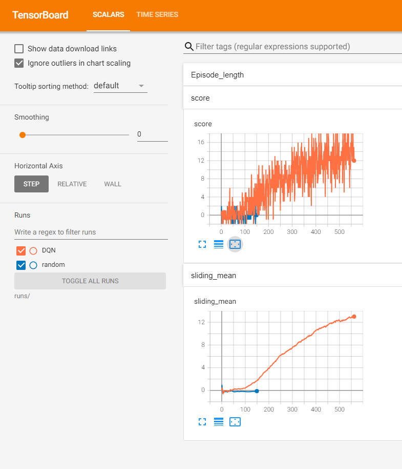

[//]: # (Image References)

[image1]: https://user-images.githubusercontent.com/10624937/42135619-d90f2f28-7d12-11e8-8823-82b970a54d7e.gif "Trained Agent"


# Project 1: Navigation

![Trained Agent][image1]

Here you can find my solution to the 1st project of the Udacity Deep RL course.
A detailed report of my solution and changes to code provided my Udacity you can find in the [Report.md](Report.md)

A reward of +1 is provided for collecting a yellow banana, and a reward of -1 is provided for collecting a blue banana. Thus, the goal of your agent is to collect as many yellow bananas as possible while avoiding blue bananas.  

The state space has 37 dimensions and contains the agent's velocity, along with ray-based perception of objects around agent's forward direction.  Given this information, the agent has to learn how to best select actions.  Four discrete actions are available, corresponding to:
- **`0`** - move forward.
- **`1`** - move backward.
- **`2`** - turn left.
- **`3`** - turn right.

The task is episodic, and in order to solve the environment, your agent must get an average score of +13 over 100 consecutive episodes.


### Getting Started

1. Download the environment for 20 agents from one of the links below.  You need only select the environment that matches your operating system:
    - Linux: [click here](https://s3-us-west-1.amazonaws.com/udacity-drlnd/P1/Banana/Banana_Linux.zip)
    - Mac OSX: [click here](https://s3-us-west-1.amazonaws.com/udacity-drlnd/P1/Banana/Banana.app.zip)
    - Windows (32-bit): [click here](https://s3-us-west-1.amazonaws.com/udacity-drlnd/P1/Banana/Banana_Windows_x86.zip)
    - Windows (64-bit): [click here](https://s3-us-west-1.amazonaws.com/udacity-drlnd/P1/Banana/Banana_Windows_x86_64.zip)
    
    (_For Windows users_) Check out [this link](https://support.microsoft.com/en-us/help/827218/how-to-determine-whether-a-computer-is-running-a-32-bit-version-or-64) if you need help with determining if your computer is running a 32-bit version or 64-bit version of the Windows operating system.


2. Unzip (or decompress) the file.

3. Add the path of the environment to the `config.py`
- **Mac**: `PATH_TO_BANANA="path/to/Banana.app"`
- **Windows** (x86): `PATH_TO_BANANA="path/to/Banana_Windows_x86/Banana.exe"`
- **Windows** (x86_64): `PATH_TO_BANANA="path/to/Banana_Windows_x86_64/Banana.exe"`
- **Linux** (x86): `PATH_TO_BANANA="path/to/Banana_Linux/Banana.x86"`
- **Linux** (x86_64): `PATH_TO_BANANA="path/to/Banana_Linux/Banana.x86_64"`
- **Linux** (x86, headless): `PATH_TO_BANANA="path/to/Banana_Linux_NoVis/Banana.x86"`
- **Linux** (x86_64, headless): `PATH_TO_BANANA="path/to/Banana_Linux_NoVis/Banana.x86_64"`

4. Create a new python virtual env with python 3.6 and activate it.

5. Install the required python packages:
```bash
    cd python
    pip install .
```

Please note this from the [Udacity Deep RL repo](https://github.com/udacity/deep-reinforcement-learning) to assure the same behavior. I just extended the requirements by `tqdm` which I use for visualization.

In case you already have an python env from the Udacity course, feel free to just
```bash
pip install tqdm
```

### Play / Inference

In this repo you find the weights for a fully trained agent in the `checkpoint.pth`.
In order to watch a game you can just start the `play.py`
```bash
python play.py
```

### Training

In order to start a new training from just execute the `train.py` script.
```bash
python train.py
```

In my case it did take 562 episodes to achieve the metric:




If you install xtensorboard
```bash
pip install xtensorboard
```

you can also see all metrics in tensorboard

```bash
tensorboard --logdir runs
```




# Search for hyperparameter

If you want to search for even better hyperparameter, feel free to use (and adapt) the `search.py` script.
All you need is to install ray tune and the according bayesian optimizer.

```bash
pip install ray
pip install bayesian-optimization
```

Note: I did find the hyperparamter here by manual trial and error and did NOT use this script here.

# Code structure

Note that the following files are identical in all my Udacity projects, so I could reuse the code easier:

```
agents.py
environment.py
memory.py
model.py
training.py
```
