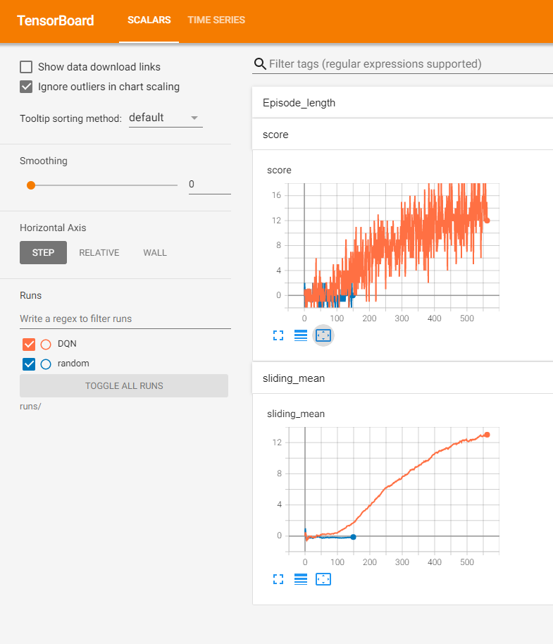

# Report for project 1: Navigation

The goal of this project is to train an agent to collect the right kind of banana and avoid the other ones. For more detailed description have a look at the [README.md](README.md). The task is solved if the sliding mean (over 100 episodes) is above 13.

## Learning Algorithm
Since the action space is discrete it seems to be suited for a DQN approach. As starting point I did take the code that was provided by Udacity.
But first I need a baseline.

### Baseline
To contrast progress by a learned agent, I created a random agent first:

```python
class Random(Agent):
    def __init__(self, action_size) -> None:
        """A random agent as a baseline."""

        super().__init__()
        self.action_size = action_size

    def act(self, state):
        batch_size = state.shape[0]
        return np.random.randint(self.action_size, size=batch_size)

    def step(self, state, action, reward, next_state, done) -> None:
        pass
```

With this agent sometimes there is some little positive reward, but its sliding mean cant hit even 0.5.

### DQN

For the network I did choose 3 layers and 64 hidden units activated with RELU. After playing a bit with the hyperparamter the following combination worked out for me:

```python
"eps_start": 1.0,
"eps_range": 0.99,
"eps_decay": 0.995,
"lr": 5e-4,
"tau": 1e-3,
"gamma": 0.99,
"target_update_interval": 4,
```

I hit the target metric after 562 episodes. 

Here is on tensorboard screenshot of the reward curves:



Please note that the sliding mean is in tensorboard log scale!
- random (blue): The random agent as baseline.
- DQN (orange): My proposed model.


## Ideas for Future Work

### Rainbow
As pointed out in ["Rainbow: Combining Improvements in Deep Reinforcement Learning"](https://arxiv.org/abs/1710.02298) there are some DQN modification that can improve the performance:
- Double DQN (DDQN)
- Prioritized experience replay
- Dueling DQN
- Learning from multi-step bootstrap targets
- Distributional DQN
- Noisy DQN

It would be interesting to see, how much each of those would contribute to faster convergence for this simple task.

### Hyperparameter search
As mentioned before, my hyperparameter search was just trial and error and I assume there are even better ones.
I wrote my code in way so its very easy to run a hyperparameter search with "ray tune". Check out the `search.py`.
I did run it for a short while, but since the parameter space is already quite big and did not find any good combination.
But I assume with enough time and computing power you could find better.
